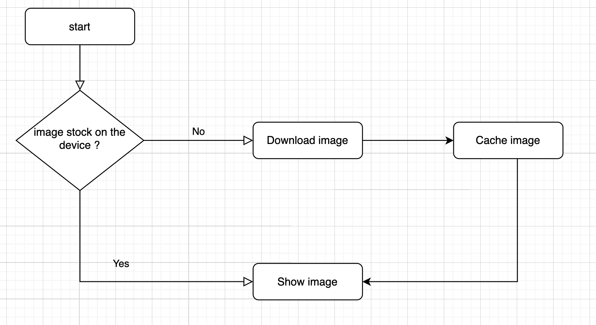

# react-native-cache-image

Smart React-Native component which cache image on the device when loaded

## Installation

```sh
npm install react-native-cache-image
```

How to show image in a markdown file

## How it works



## Usage

```js
import { CacheImage } from 'react-native-cache-image';

<CacheImage source={{ uri: 'https://picsum.photos/200/300' }} />;
```

## Props

| Prop                   | Type                    | Default     | Description                                             |
| ---------------------- | ----------------------- | ----------- | ------------------------------------------------------- |
| source                 | `ImageSourcePropType`   | `''`        | The source of the image                                 |
| resizeMode             | `ImageResizeMode`       | `cover`     | The resize mode of the image                            |
| defaultImage           | `ImageSourcePropType`   |             | The default image to show when the source is not loaded |
| defaultImageResizeMode | `ImageResizeMode`       | `undefined` | The resize mode of the default image                    |
| defaultImageStyle      | `StyleProp<ImageStyle>` | `undefined` | The style of the default image                          |
| imageStyle             | `StyleProp<ImageStyle>` | `undefined` | The style of the image                                  |
| errorImage             | `ImageSourcePropType`   |             | The image to show when the source is not loaded         |
| errorImageStyle        | `StyleProp<ImageStyle>` | `undefined` | The style of the error image                            |
| style                  | `StyleProp<ImageStyle>` | `undefined` | The style of the image container                        |
| containerStyle         | `StyleProp<ViewStyle>`  | `undefined` | The style of the image container                        |

## Contributing

See the [contributing guide](CONTRIBUTING.md) to learn how to contribute to the repository and the development workflow.

## License

MIT

---

Made with [create-react-native-library](https://github.com/callstack/react-native-builder-bob)
